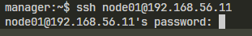
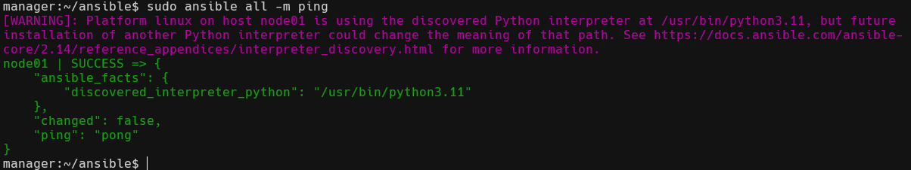
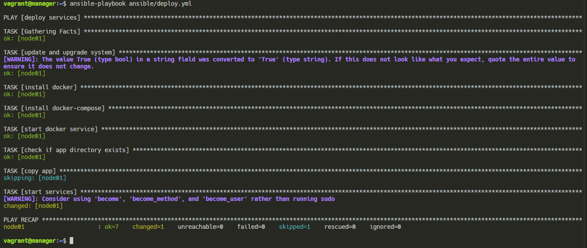
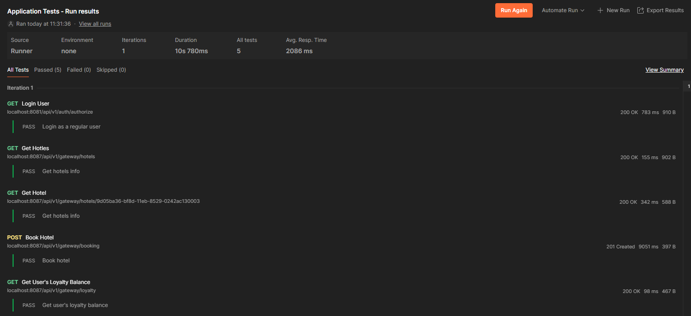
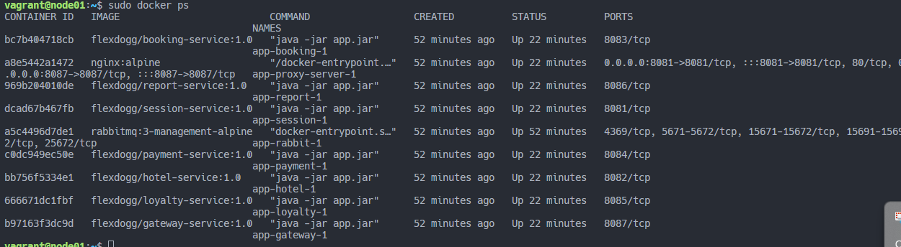
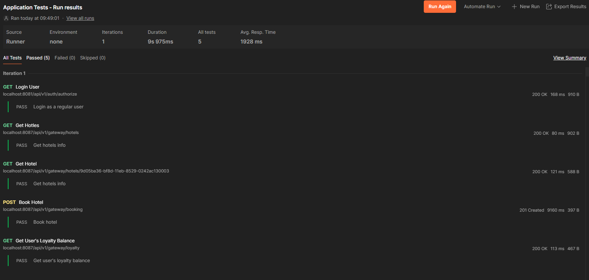
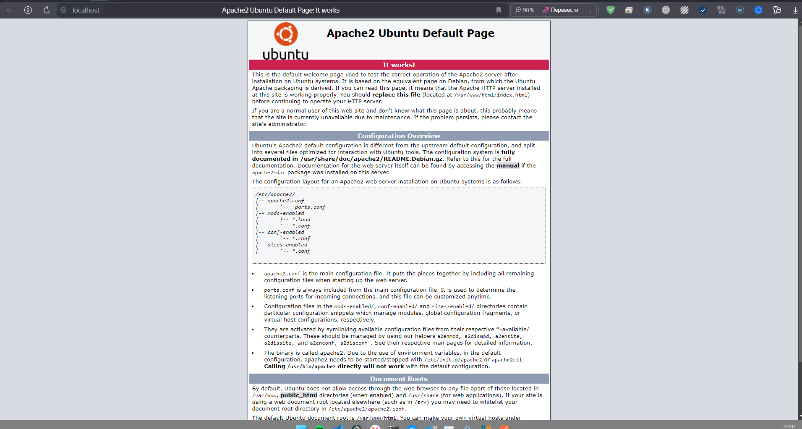
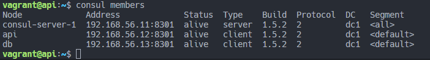
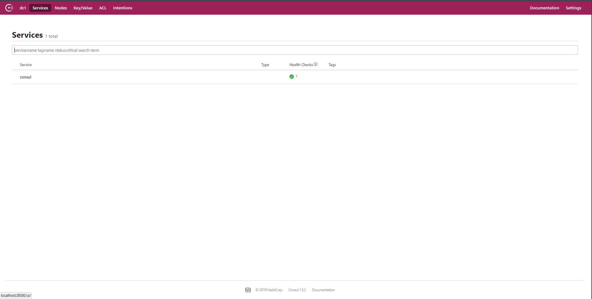
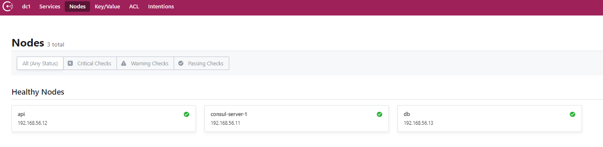

## Part 1. Удаленное конфигурирование узла через Ansible

**1. Создадим 3 машины - manager, node01, node02 с помощью vagrant:**  

- Инициализируем vagrant: ```vagrant init```  
 
- Пропишем необходимые машинки в [Vagrantfile](ansible01/Vagrantfile_1path):  
 

- Запустим машины: ```vagrant up```  

**2. Подготовим manager как рабочую станцию для удаленного конфигурирования:**  

- Зайдем на manager: ```vagrant ssh manager```  

- Проверим подключение к node01 по ssh:   
  

- Сгенерируем ssh-ключ для подключения к node01 из manager  
  ```
  ssh-keygen -t rsa -b 4096 -N ""  
  ```

- Отправим ssh-ключ на node01  
  ```
  ssh-copy-id vagrant@192.168.56.11  
  ```

- Установим **ansible** на manager: ```sudo apk add ansible```   

- Cоздамим папку **ansible**: ```mkdir ansible```   

- Создадим конфигурационный файл [ansible.cfg](ansible01/ansible.cfg):  

- Создадим inventory-файл [hosts](ansible01/ansible/hosts):  

- Попробуем пингануть хост node01 с помощью ansible:  
```ansible all -m ping```  
  

**3. Напишем playbook для ansible, который обновляет систему, устанавливает докер и копирует файлы микросервисного приложения и разворачивает его на node01**  

- Напишем [deploy.yml](ansible01/ansible/deploy.yml)  

- Запустим плэйбук: ```ansible-playbook ansible/deploy.yml```  
    

**4. Проверим работу сервиса с помощью Postman**  
  

**5. Сформируем три роли**  

- создадим 3 роли: application, apache, postgres. С ними можно ознакомиться в папке **ansible01/ansible/roles**.   

- Пропишем таски для каждой роли [postgres](ansible01/ansible/roles/postgres/tasks/main.yml), [application](ansible01/ansible/roles/application/tasks/main.yml), [apache](ansible01/ansible/roles/apache/tasks/main.yml). Также пропишем vars.   

- Перепишем [Vagrantfile](ansible01/Vagrantfile_2path)  

- Уберем из [docker-compose](ansible01/ansible/roles/application/files/docker-compose.yml) запуск базы данных. И будем запускать ее на node01, для этого в [db.env](ansible01/ansible/roles/application/files/db.env) изменим хост.  

- Запустим с плейбук: ```ansible-playbook ansible/deploy2.0.yml```  

- Проверим работуспобность контейнеров сервиса:  
  

- Проверим работоспособность сервиса:    
  

- Проверим работу apache, зайдя на localhost:80:  
  

## Part 2. Service Discovery  

- Напишем [Vagrantfile](Vagrantfile)  

- Напишем роли [install_consul_client](ansible02/roles/install_consul_client/tasks/main.yml), [install_consul_server](ansible02/roles/install_consul_server/tasks/main.yml), [install_hotels_service](ansible02/roles/install_hotels_service/tasks/main.yml), [install_db](ansible02/roles/install_db/tasks/main.yml)  

- Запустим все машинки: ```vagrant up```


- На manager сгенерируем ssh ключ и прокинем на все остальные виртуалки ssh ключ:  
  ```
  ssh-keygen -t rsa -b 4096 -N "" 
  ssh-copy-id vagrant@192.168.56.11 
  ssh-copy-id vagrant@192.168.56.12
  ssh-copy-id vagrant@192.168.56.13
  ```  

- Запустим наш плейбук: ```ansible-playbook deploy.yml```  

- Проверим работоспособность consul:  
  

- Чтобы заработал графический интерфейс на localhost, надо подключиться к consul_server с manager: ```socat TCP-LISTEN:8500,fork TCP:192.168.56.11:8500 &```  
  
  

